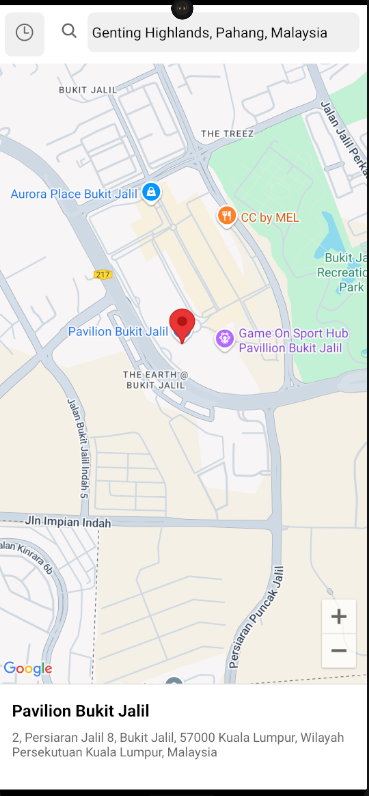

React Native Search Places Using Google Map API key by Sandy Tadete

=Features=

1. Search for places using Google Places API
2. Autocomplete suggestions as you type
3. View selected locations on a map
4. Search history functionality taht maintainable using async storage (redux too powerful for this)

=ScreenShot=

=Basic following requirements=

1. Node.js (v14.0.0 or later) npm or yarn
2. React Native development environment set up
3. Google Cloud account with Maps and Places APIs enabled
4. Expo CLI (using expo)

=Installation=

1. Clone the repository:
   bashgit clone https://github.com/sandyalta/rn-sandy-search-place.git
   cd rn-sandy-search-place

2. Install dependencies:
   npm install

   # or

   yarn install

3. Create a .env file in the root directory with your Google Maps API key:
   GOOGLE_MAPS_API_KEY=your_api_key_here

=Setting up Google Maps API=

1. Go to the Google Cloud Console
2. Create a new project or select an existing one
3. Enable the following APIs:
4. Places API
5. Create an API key
6. Add the API key to your .env file as shown in the installation steps
